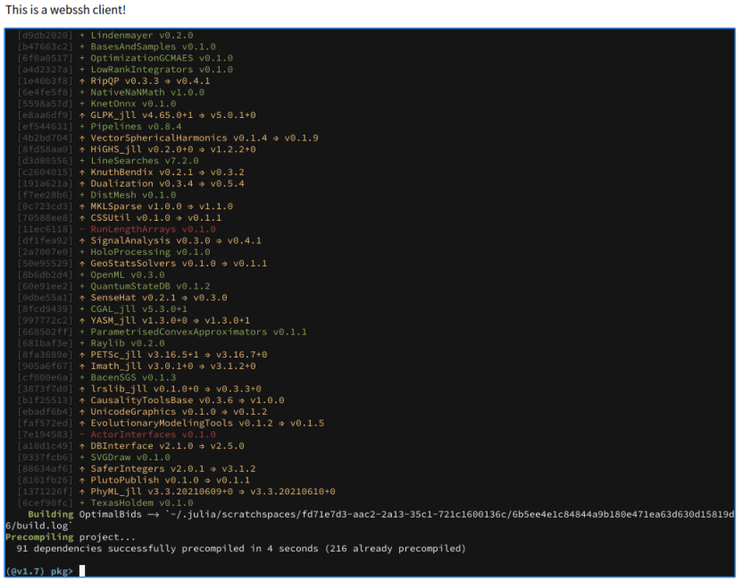

# WebSSH

A pure wasm ssh client with `russh` and `os-terminal`.

## Screenshot



## Features

- SSH client on the browser (no secrets passed to the server, safe without tls)
- No stuck and responsive on large output

## Usage

Install dependencies first:

```bash
pnpm install
```

To connect to ssh server, we need a websocket to tcp proxy.

You can use the provided `wsrelay.js`. Set `WS_HOST`, `WS_PORT`, `TCP_HOST`, `TCP_PORT`, and then run:

```bash
node wsrelay.js
```

Or use some other proxy you prefer like `websockify` or `wstcp`:

```bash
wstcp 127.0.0.1:22 --bind-addr 0.0.0.0:19198 
```

Then edit the `src/lib.rs` and set the ssh username/password and websocket address.

Finally start the development server:

```bash
pnpm serve
```

If you encounter an error like `Rust compilation` along with `invalid type: sequence, expected a string at line 5 column 11`, do not worry it is [`wasm-pack`'bug](https://github.com/rustwasm/wasm-pack/issues/1420). Just force stop the command and try again.
